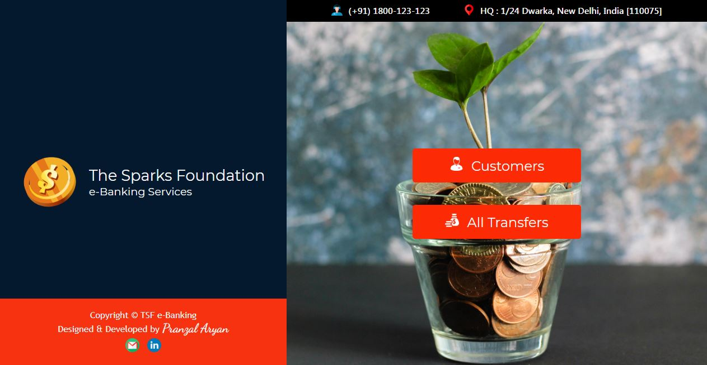

# TSF_Banking_Website
##### During: The Sparks Foundation Internship (May 2021)
#### Designed and Developed by: Abhishek kumar yadav

### Objective of the Project:
##### To show a basic working Model of a Banking Website with minimum facilities, as shown below.

### Introduction to the Project:
##### The Website is equipped with features like:
  <ul type="disc">
  <li>Transferring Money from one Customer's Account to another, with automatic updation of Current Balances of both customers in DB.</li>
  <li>View all the Customers Records.</li>
  <li>View all Transaction History.</li>
  </ul>
The Website is fully Responsive and thus works completely fine on all Screen sizes.  

### Languages and Technologies Used:
  <ul type="disc">
  <li>HTML</li>
  <li>CSS</li>
  <li>JS</li>
  <li>PHP</li>
  <li>MySQL</li>
  </ul>

